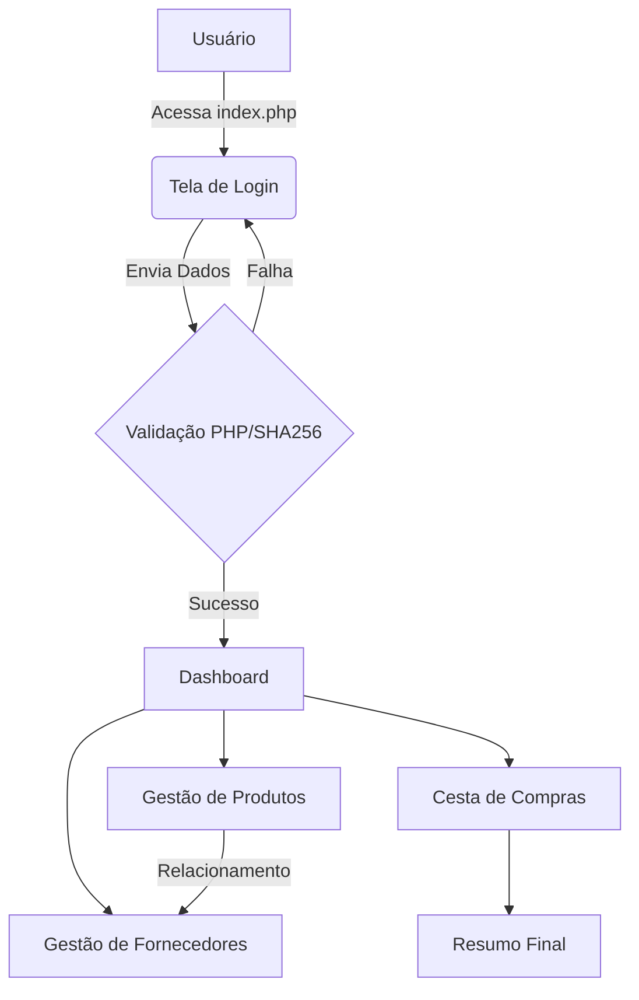

## 1- Arquitetura do Projeto (MVC)
O projeto segue uma estrutura de separação de responsabilidades para garantir segurança e escalabilidade.

Frontend (View): Desenvolvido com HTML5, CSS3 (Bootstrap 5) e JavaScript (AJAX/Fetch API). Localizado na pasta public/.

Backend (Controller/Model): Desenvolvido em PHP 8.x utilizando PDO para persistência de dados. Localizado na pasta app/ e config/.

Banco de Dados: MySQL com relacionamentos de integridade referencial.

## 2- Fluxos de Processos 

## 3- Decomposição Funcional

# Frontend (Pasta public/)
index.php: Ponto de entrada. Contém o formulário de login e chamadas de segurança.

dashboard.php: Painel administrativo com navegação principal.

fornecedores.php: Interface de CRUD para fornecedores.

produtos.php: Interface de CRUD para produtos com vínculo de fornecedor.

selecao.php (Cesta): Vitrine com checkboxes para seleção dinâmica.

js/main.js: Centraliza as requisições AJAX para evitar o reload da página.

# Backend (Pasta app/ & config/)
config/conexão.php: Singleton de conexão PDO e scripts de Auto-Semente (criação automática de tabelas).

app/auth.php: Lógica de verificação de hash SHA256 e controle de $_SESSION.

app/Models/: Classes que representam as entidades do banco (Produto e Fornecedor).

app/Controllers/: Scripts que processam as requisições POST/GET e interagem com o Model.

## 4- Requisitos do Sistema (Documentação Técnica)
RF01 - Autenticação: O sistema deve exigir login para acessar qualquer tela de gestão.

RF02 - Criptografia: Senhas devem ser armazenadas em SHA256.

RF03 - Cadastro Relacional: Um produto não pode existir sem um fornecedor vinculado.

RF04 - Persistência Temporária: A cesta de compras deve ser mantida via Sessão (não requer banco).

RNF01 - Interface: Deve utilizar Bootstrap para garantir responsividade.

RNF02 - Desempenho: Operações de listagem devem utilizar AJAX/Fetch para melhorar o UX.